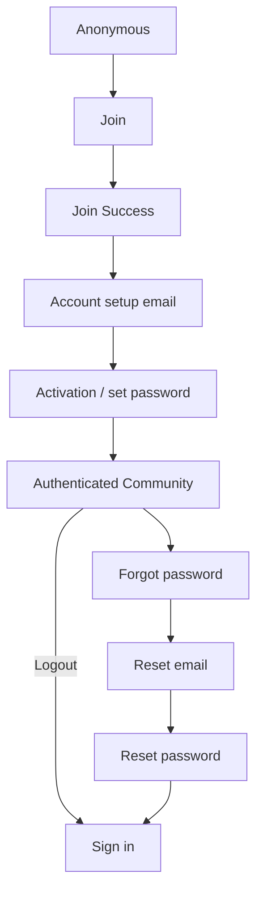

# Community member account lifecycle

This document describes the implemented member-facing account lifecycle in
`elevate-mk-community`.

The Community frontend is an Angular application separate from the Staff CRM
frontend. It uses the shared Elevate MK Django API for identity, membership,
eligibility and account state. Canonical member identity remains backend
owned: Community does not maintain a separate Person, User or Membership
identity database. Authentication uses Django session cookies and does not use
JWTs.

## Lifecycle overview



The frontend presents the flow and sends the required credentials and form
data; the backend remains authoritative for identity matching, eligibility,
membership, password policy and session state.

## Join

The public Join route is `/join` (the root route redirects to `/join`). The
form currently collects:

- first name and last name;
- gender and age range;
- email address;
- optional mobile number and phone region;
- location;
- industry, loaded from the Community industry endpoint;
- current role / job title;
- optional LinkedIn profile;
- optional email marketing opt-in.

The frontend first loads industry options with:

```text
GET /api/v1/community/industries/
```

On submission it obtains a CSRF token, then sends:

```text
POST /api/v1/community/join/
```

The request includes the form payload and an `Idempotency-Key` header. The
frontend keeps the same generated key while retrying the same logical payload
after a retryable failure, and generates a new key if the payload changes.
The backend owns the idempotency decision.

When a mobile number is supplied, the selected `phone_region` is sent with
the number. The backend validates the region/number compatibility and stores
new Community mobile values in its canonical form. The frontend does not
infer identity from the phone region or calling code.

The Join request is CSRF protected and uses credentialed API requests. An
accepted response navigates to `/join/success` using replacement navigation.
Field validation errors remain associated with their fields. A safe review
response is shown generically, without disclosing which CRM record or
membership caused it. Retryable transport/server failures use the global
notification with a retry action.

### Join identity safety

These are backend-authoritative rules exposed by the frontend behavior:

- name alone is not an identity signal;
- safely matched existing CRM/member records may be reused by the backend;
- contradictory identity evidence may require review;
- anonymous Join does not disclose whether a particular CRM record exists;
- ordinary profile differences are not presented as field-by-field conflicts;
- a `FORMER` membership is not silently reactivated.

The optional email marketing choice is submitted as part of Join. It is not
an authentication or membership-state signal.

## Join success

The success route is `/join/success`. It is reached after an accepted Join
submission and is rendered as a separate confirmation page. It explains that
membership is active and that the member should check email for the account
setup step.

The page does not put member PII in the URL and this frontend does not persist
Join PII in `localStorage` or `sessionStorage` to support the navigation. The
account setup email contains the next-step link. The page also provides the
external `Back to Elevate MK` link.

Account setup is separate from membership acceptance: the member must use the
invitation link to choose a password and establish the authenticated session.

## Account setup / activation

Activation uses the route:

```text
/activate/:invitationId/:token
```

The invalid-link state is represented by `/activate/invalid`.

The activation page first checks the invitation:

```text
GET /api/v1/community/activate/<invitationId>/<token>/
```

After the member enters and confirms a password, the frontend sends:

```text
POST /api/v1/community/activate/<invitationId>/<token>/
```

with `password` and `confirm_password`. The invitation UUID and raw token
are URL credentials for this flow; they are not Community profile data and
are not separately persisted by the frontend.

The frontend checks required fields, minimum length, numeric-only passwords
and confirmation matching. Backend password validation remains authoritative.
Invalid or expired invitations receive a generic invalid-link state. An
unavailable account setup receives a safe unavailable state. Password-policy
errors are displayed against the relevant fields.

After successful activation, Django establishes the session. The frontend
refreshes CSRF state because authentication rotates CSRF state, stores the
minimal current user in its in-memory auth service, and navigates directly to
`/community` with replacement navigation. A second sign-in is not required.

## Sign in

The guest sign-in route is `/sign-in`. It uses:

```text
POST /api/v1/community/login/
```

The sequence is:

1. Bootstrap CSRF with `GET /api/v1/auth/csrf/`.
2. Submit the email and password to the Community login endpoint.
3. Let the backend authenticate the shared User and check Community
   eligibility.
4. Refresh CSRF state after successful login.
5. Store the minimal current-user representation in memory.
6. Navigate to `/community`.

Invalid credentials and unavailable Community access are presented as
separate safe UI states. Neither state exposes unnecessary account existence
information. Community uses its own login endpoint even though the underlying
User/account is shared with the wider Elevate platform.

The guest guard redirects an already authenticated member from `/sign-in` to
`/community`. The authenticated guard protects `/community`,
`/community/profile` and `/community/profile/edit`; an unauthenticated member
is redirected to `/join`.

## Session restoration

On application use and protected-route navigation, the frontend calls:

```text
GET /api/v1/community/me/
```

The session cookie is sent with the credentialed request. A successful
response restores the current Community user in memory. A `401` clears the
in-memory user and marks the session as unauthenticated. Angular does not
store a JWT or access token, and authentication is not established solely
from browser storage.

## Logout

The authenticated Community shell sends:

```text
POST /api/v1/auth/logout/
```

The request is credentialed and CSRF protected. On success, the frontend
clears its in-memory current user and returns to `/join`. Protected-route
guards then prevent access without a valid backend session.

CSRF is refreshed after login and activation because Django authentication
rotates CSRF state. This is part of the normal session model, not a separate
login step.

## Forgot password

The forgot-password route is `/forgot-password`. The member submits an email
to:

```text
POST /api/v1/community/password-reset/
```

The page shows a generic confirmation explaining that, if an eligible
Community account exists, reset instructions were sent. The UI/API contract
does not reveal whether the submitted email belongs to an account.

This recovery flow is for an existing activated Community account. It is
separate from the initial activation email sent after Join.

## Reset password

The reset route is:

```text
/reset-password/:uid/:token
```

The page submits the new password and confirmation to the Community-specific
endpoint:

```text
POST /api/v1/community/password-reset/confirm/
```

The request contains the route-supplied `uid` and `token`, plus
`new_password` and `confirm_password`. The frontend provides basic length,
numeric-only and matching checks, while backend password validation remains
authoritative.

At redemption time the backend rechecks Community eligibility. A member who
has become ineligible cannot use a previously issued reset link. Invalid or
expired links receive generic safe handling. A successful reset changes the
password and invalidates existing Django-authenticated sessions when they are
next used, including the current Community browser session. It does not
automatically sign the member in; the member receives explicit sign-in-again
guidance and returns to `/sign-in`.

## Verified email change

Authenticated members request an email change from `/community/account` with
the current password. The backend sends a durable transactional message to
the requested new address; the frontend does not receive or store the raw
verification token.

The verification link opens:

```text
/community/account/verify-email/:requestId/:token
```

The page automatically posts the route credentials once to the public-capable,
CSRF-protected API endpoint. A successful response updates the canonical
Person/User email atomically, queues provider synchronization and an
old-email security notification, clears the current frontend session state,
and shows a sign-in action. The page replaces the URL after the attempt so
the token is removed from browser history where practical. It never
auto-signs the member in. Invalid or expired links use generic safe wording;
transient failures offer retry without persisting the token.

## CSRF and session model

Community authentication uses Django session authentication:

- API requests are sent with credentials so the session cookie is included;
- `GET /api/v1/auth/csrf/` bootstraps CSRF state;
- unsafe requests receive an `X-CSRFToken` header from the in-memory token;
- the frontend does not depend on reading the API-origin `csrftoken` cookie;
- successful login and activation refresh CSRF state after Django rotates it;
- no JWT or localStorage access token is used.

The frontend interceptor applies credentials to requests for the configured
API base URL and adds the in-memory CSRF header to unsafe requests when a
token is available. Guards improve navigation UX; backend authentication and
authorization remain the security boundary.

## API base URL and deployment

Community deployment configuration uses the environment variable:

```text
API_BASE_URL
```

It must be an absolute HTTP(S) URL ending in `/api/v1`, for example:

```text
https://api.example.org/api/v1
```

Do not include a route suffix such as `/community/join/` in this value.

`scripts/write-environment.mjs` validates the value, removes trailing
slashes, and generates `src/environments/environment.ts` for Railway builds.
The required configuration check is:

```bash
npm run test:config
```

Local development uses the checked-in development API configuration. The
production hostname is deployment-specific and is intentionally not
hardcoded in this document.

## Security and privacy invariants

- Anonymous flows do not expose CRM or account existence.
- Authentication uses Django sessions, not JWTs.
- Unsafe API requests are CSRF protected.
- Activation and password-reset tokens are URL credentials and are not
  treated as profile data or persisted unnecessarily.
- Join PII is not placed in browser storage merely to support success
  navigation.
- Password-reset requests are enumeration-safe.
- Community eligibility remains backend-authoritative.
- Frontend guards and validators improve UX but are not security boundaries.

